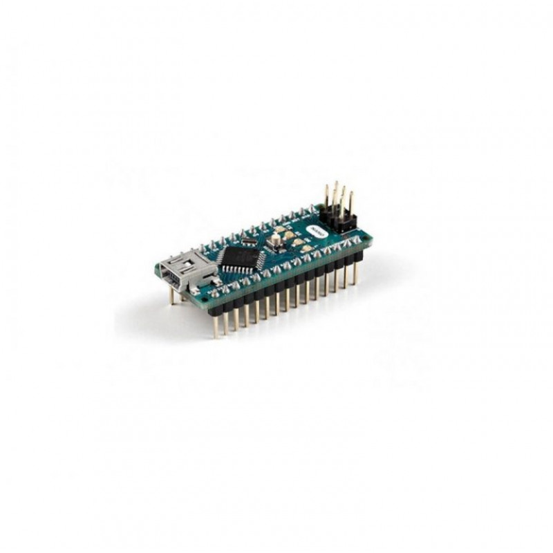
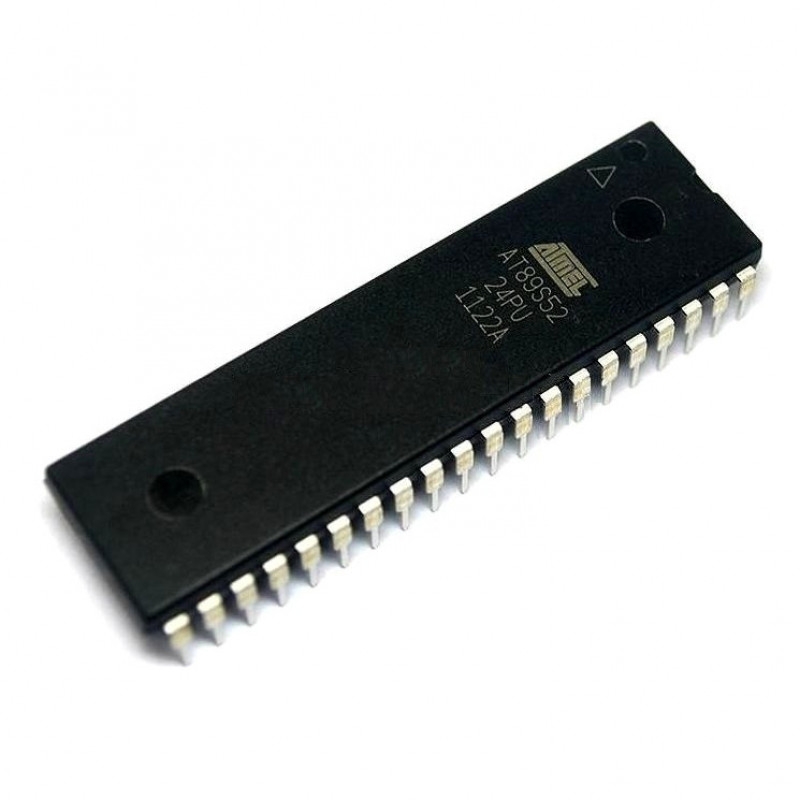
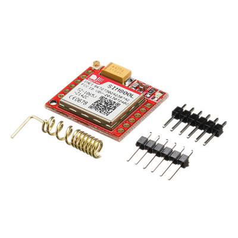
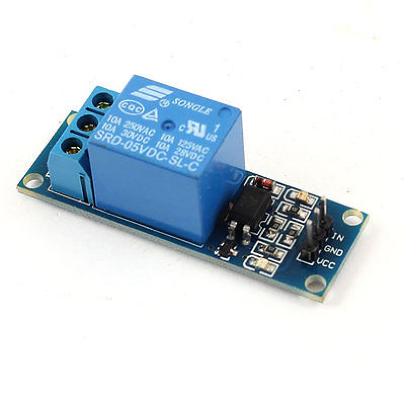
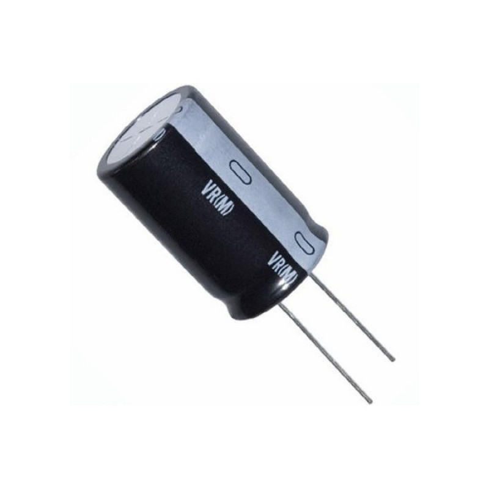

# gsmmotor
# gsm motor controller
<p> it is a device made with arduino or 8051 microcontroller, when
you send an sms "On" from your registred mobile number it will on and send sms "Off" it will of you can on and off your motor from any where.
</p>
<h4>#stay_home<br>#stay_safe</h4>
<h2>components required </h2>

<p >1. arduino nano</p><br><br>
<h3>or</h3>

<p >2. 8051 family microcontroller</p><br><br>

<p >3. gsm 800l</p><br><br>

<p >4. relay</p><br><br>

<p >5. 5v DC adapter</p><br><br>

<p >6. capacitor</p><br><br>

<h3>arduino code </h3>

```c

#include <SoftwareSerial.h>
SoftwareSerial gsm(10, 11);
String bu;
String number;
int led=A3;
void setup()
{
 pinMode(led,OUTPUT);
 digitalWrite(led,HIGH);
 Serial.begin(9600);
 gsm.begin(9600);

 Serial.println("Initializing...");
 delay(1000);

while(1)
{
  gsm.println("AT");
  delay(500);
  if(updateSerial().indexOf("OK")!=-1)
  {
   break;
  }
}
  gsm.println("AT+CMGF=1"); // Configuring TEXT mode
 updateSerial();
 gsm.println("AT+CNMI=1,2,0,0,0"); // Decides how newly arrived SMS messages should be handled
 updateSerial();


}

void loop()
{
while(gsm.available())  
{if(updateSerial().indexOf("on")!=-1)
{
 digitalWrite(led,LOW);
 Serial.println("on");
   gsm.println("AT+CMGS=\"+919704654772\"");
 updateSerial();
 gsm.print("motor on\ntokapuram.github.io/profile"); //text content
 updateSerial();
 gsm.write(26);
}
if(updateSerial().indexOf("off")!=-1)
{
 digitalWrite(led,HIGH);
 Serial.println("off");
     gsm.println("AT+CMGS=\"+919704654772\"");//change ZZ with country code and xxxxxxxxxxx with phone number to sms
 updateSerial();
 gsm.print("motor off\ntokapuram.github.io/profile"); //text content
 updateSerial();
 gsm.write(26);
}

}
}

String updateSerial()
{
 delay(500);
 while(gsm.available())
 {
   bu=gsm.readString();
   Serial.println(bu);//Forward what Software Serial received to Serial Port
 }
 return bu;
}
```
<br><br>

<p >full connections</p><br><br>
